# Lab Report 01

## Problems:

### 1. Write a C program to read and display values of all basic data types.
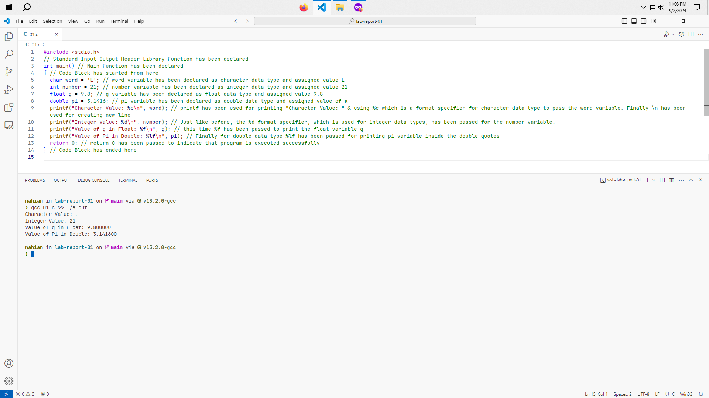

### 2. Write a C program to input two numbers and find their sum.
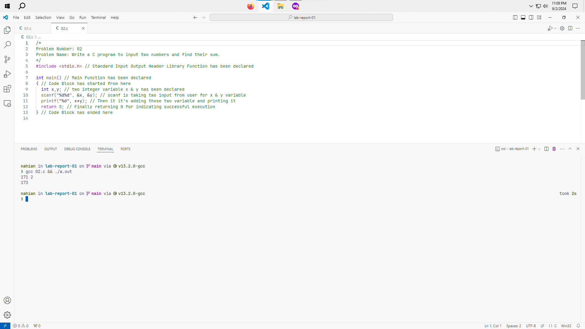

### 3. Write a C program to input two numbers and perform all
   arithmetic operations (addition, subtraction, multiplication, and division).
   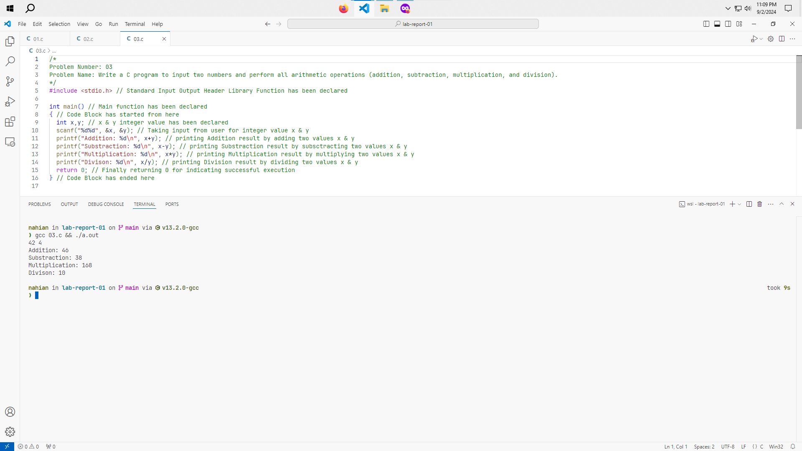

### 4. Write a C program to input the length and width of a rectangle and find its perimeter.
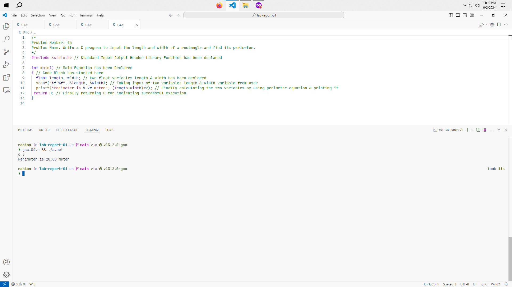

### 5. Write a C program to input the length and width of a rectangle and find its area.
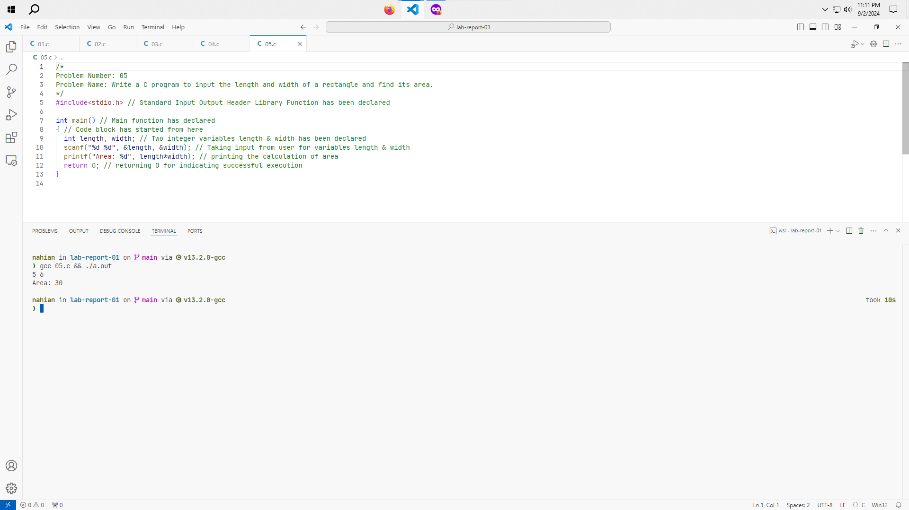

### 6. Write a C program to input the radius of a circle and find its diameter, circumference, and area.
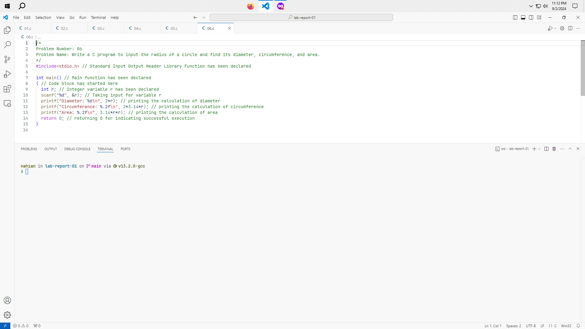

### 7. Write a C program to input a length in centimeters and convert it into meters and kilometers.
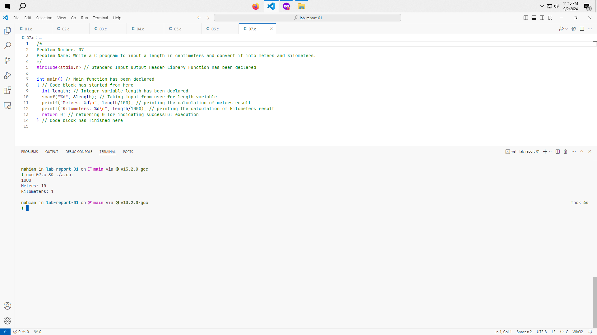

### 8. Write a C program to input a temperature in Celsius and convert it to Fahrenheit.
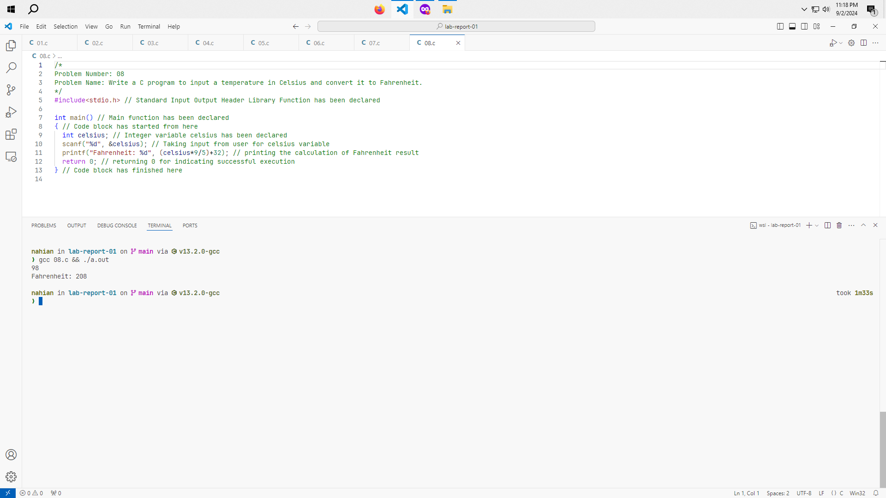

### 9. Write a C program to convert a given number of days into years, weeks, and days.
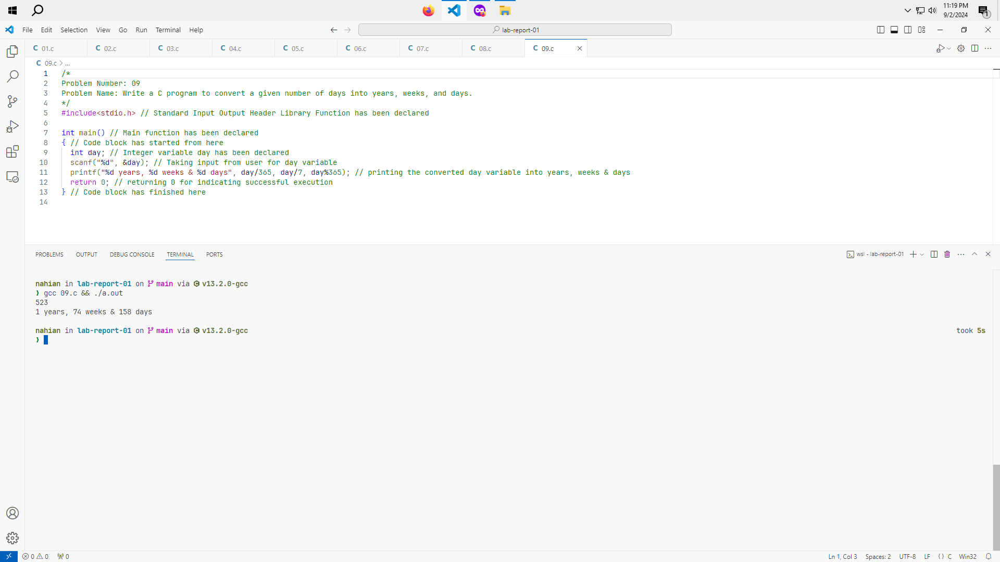

### 10. Write a C program to find the power of any number (x^y).
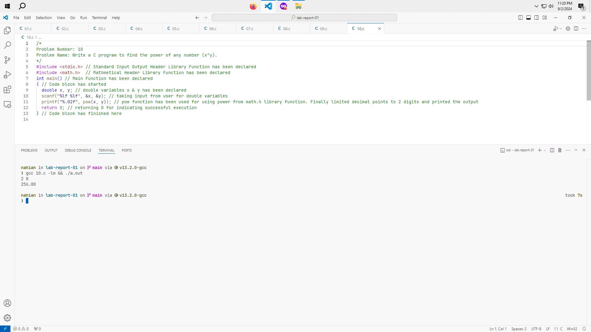

### 11. Write a C program to input a number and calculate its square root.
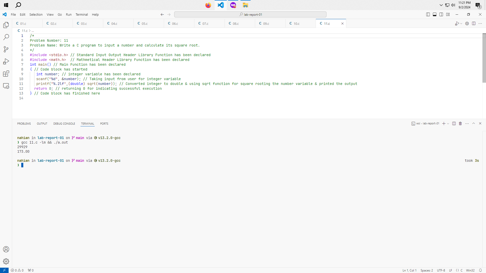

### 12. Write a C program to input two angles of a triangle and find the third angle.
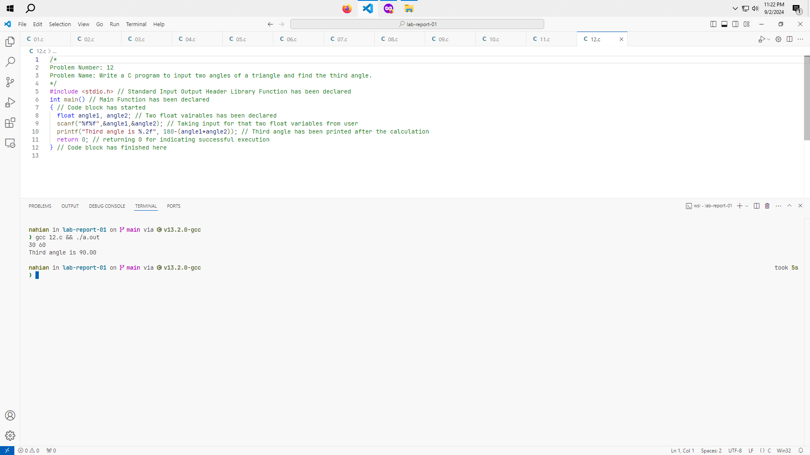

### 13. Write a C program to input the base and height of a triangle and find its area.
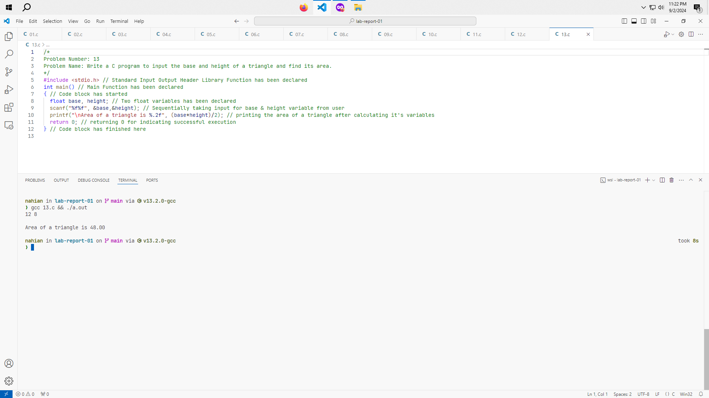

### 14. Write a C program to input marks for five subjects and calculate the total marks, average.
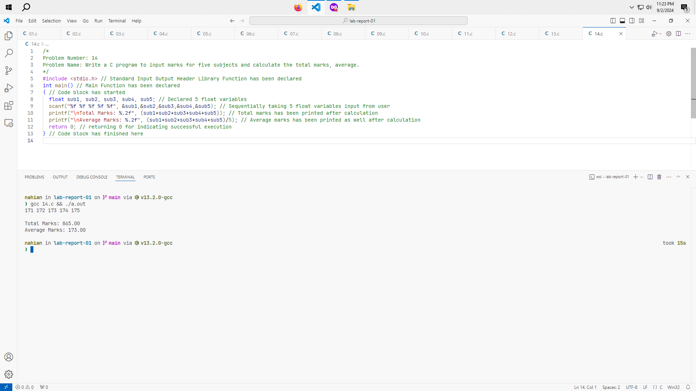